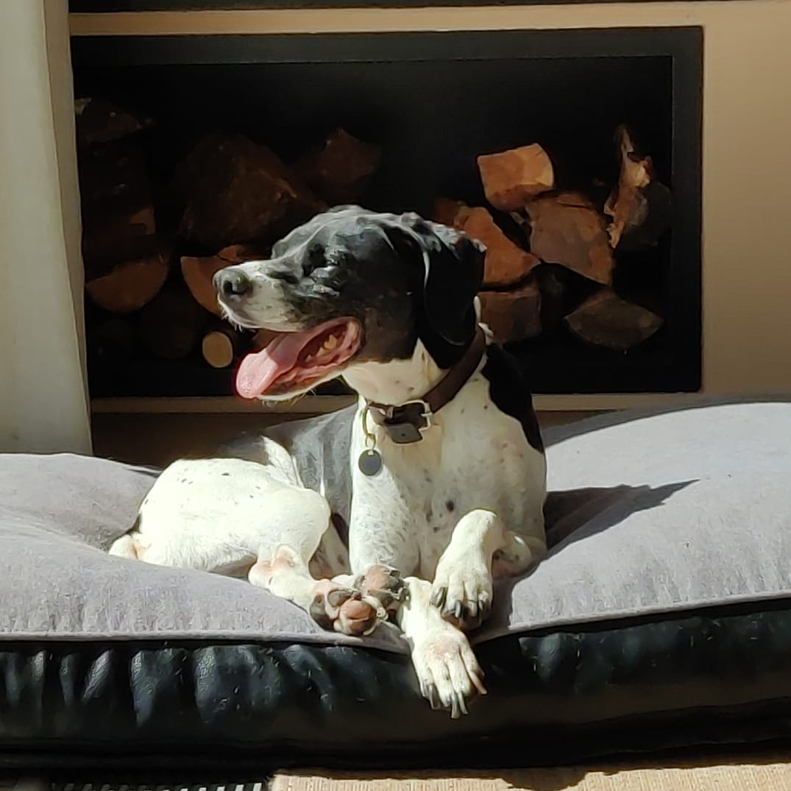

# PoloCoin

Idea:

Create an ERC-20 token named after my dog, Polo.

Create an NFT of this image, and make it so that it can only be bought using POLOCOIN.




## Running
```sh
forge init
forge build
forge test
```

## Deploying contract
```sh
forge create --rpc-url http://localhost:8545 --private-key <private_key> src/PoloCoin.sol:PoloCoin
```

## Using cast
```sh
cast call <contract_addr> "totalSupply()(uint256)"
```

## Testing specific file
```sh
forge test --match-contract <contract_name> -vv
```

## TODO

Look into:
- bridging to starknet?
- this command
```
forge clone <contract_addr> <dir_name>
```